# dubbot-stats — Source Code Documentation

A CLI tool that queries the DubBot GraphQL API for accessibility statistics
across a list of sites and appends one CSV row per site per run to a
cumulative snapshots file.

---

## Table of Contents

1. [High-Level Architecture](#1-high-level-architecture)
2. [Module Dependency Graph](#2-module-dependency-graph)
3. [Startup & Config Validation](#3-startup--config-validation)
4. [CLI Commands](#4-cli-commands)
5. [Run Flow (the main path)](#5-run-flow-the-main-path)
6. [API Client & Retry Logic](#6-api-client--retry-logic)
7. [Data Model](#7-data-model)
8. [CSV Writer Logic](#8-csv-writer-logic)
9. [Logging](#9-logging)
10. [Exit Codes](#10-exit-codes)
11. [File Reference](#11-file-reference)

---

## 1. High-Level Architecture

The tool is split into four layers that each have a single responsibility.

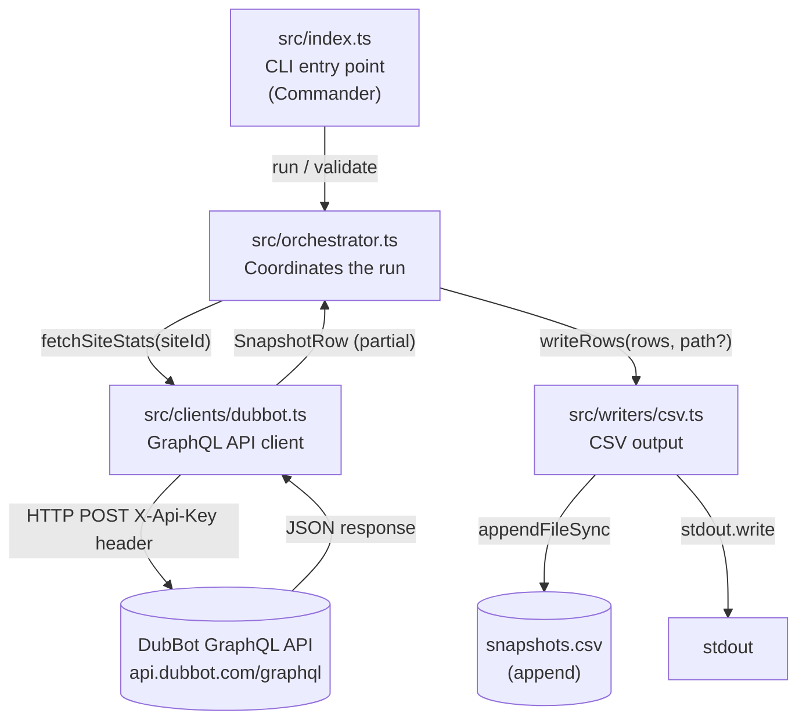

**Stdout is reserved for CSV data. All log messages go to stderr.**
This means you can safely pipe or redirect stdout without mixing logs into the CSV.

---

## 2. Module Dependency Graph

Every arrow means "imports from". `config` and `logger` are shared singletons
imported by multiple modules.

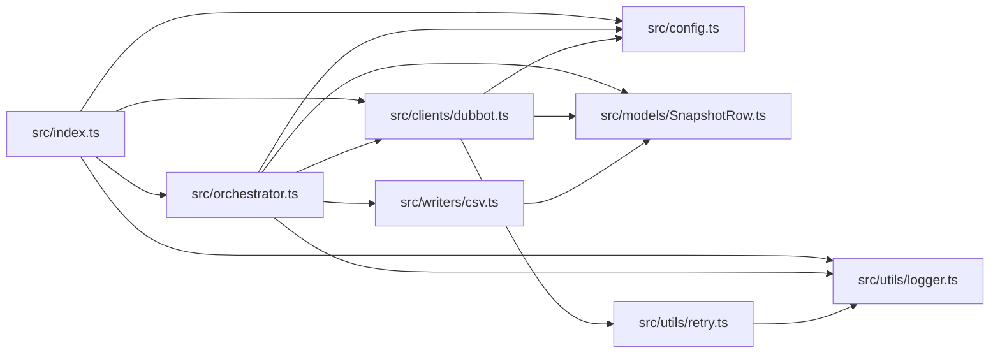

The **leaf nodes** (no outgoing arrows) are `config`, `logger`, and `model` —
they have no internal dependencies and are safe to read first.

---

## 3. Startup & Config Validation

`src/config.ts` runs the moment any other module imports it. It uses
[dotenv](https://github.com/motdotla/dotenv) to load `.env`, then validates
every variable with a [Zod](https://zod.dev) schema.

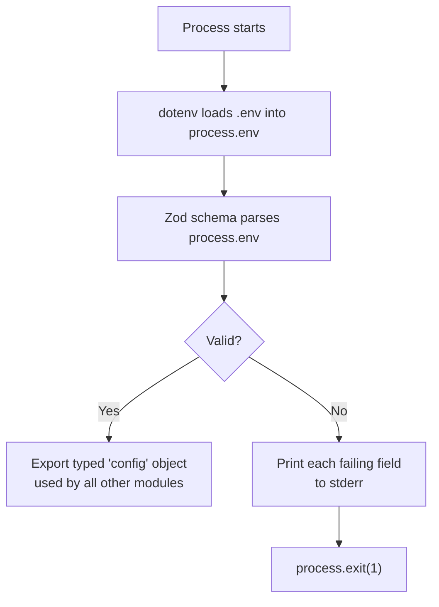

**What the schema validates:**

| Variable | Rule | Default |
|---|---|---|
| `DUBBOT_API_KEY` | non-empty string — sent as `X-Api-Key` header | — (required) |
| `DUBBOT_API_URL` | valid URL | `https://api.dubbot.com/graphql` |
| `DUBBOT_ACCOUNT_ID` | non-empty string | — (required) |
| `DUBBOT_SITE_IDS` | comma-separated string → `string[]` | — (required) |
| `OUTPUT_FILE` | string | undefined (prints to stdout) |

`DUBBOT_SITE_IDS` is automatically split on commas and trimmed, so the rest of
the code receives a ready-to-use `string[]`.

---

## 4. CLI Commands

`src/index.ts` uses [Commander](https://github.com/tj/commander.js) to define
four commands. `run` is the default — it fires when no command is specified.

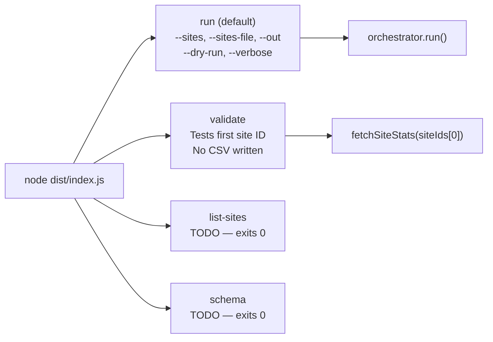

**`run` options:**

| Flag | Effect |
|---|---|
| `-s, --sites <ids>` | Comma-separated site IDs — highest priority |
| `-f, --sites-file <path>` | CSV file of site IDs — overrides env var |
| `-o, --out <file>` | Write/append to this file instead of stdout |
| `--dry-run` | Forces stdout output, ignores `--out` and `OUTPUT_FILE` |
| `--verbose` | Logs full API payloads to stderr |
| `--no-header` | Skip writing the header row — **accepted by CLI but not yet wired to `RunOptions` or `writeRows()`; currently a no-op** |

---

## 5. Run Flow (the main path)

`src/orchestrator.ts` is the brain of the tool. All sites are fetched **in
parallel** using `Promise.allSettled`, which means one failing site never
blocks the others.

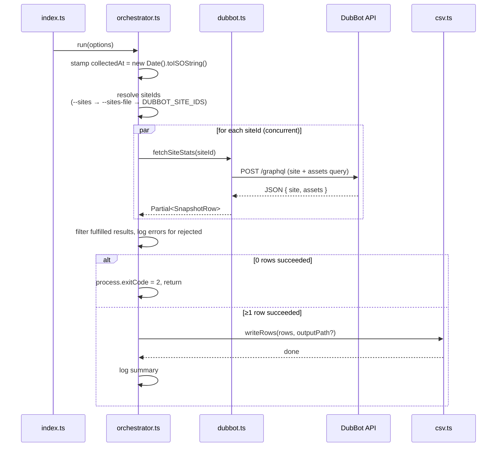

Key design decisions:

- **`collectedAt` is stamped once** before any fetches start. All rows in a
  single run share the same timestamp, so they appear as a coherent snapshot
  when charted over time.
- **`Promise.allSettled`** (not `Promise.all`) means partial success is
  allowed. If 4 of 5 sites succeed, 4 rows are written and the failure is
  logged at `error` level.
- **`dryRun` forces stdout.** When `--dry-run` is passed, `outputPath` is set
  to `undefined` regardless of `--out` or `OUTPUT_FILE`, so the writer always
  hits the stdout branch.
- **Site ID resolution priority:** `--sites` (inline) → `--sites-file` (CSV
  file) → `DUBBOT_SITE_IDS` (env var). The first source that is defined wins.

---

## 6. API Client & Retry Logic

### GraphQL Query

`src/clients/dubbot.ts` uses [`graphql-request`](https://github.com/graffle-js/graffle)
(`GraphQLClient`) to send **one HTTP request per site** that fetches both the
site stats and the PDF count in a single round-trip by combining two root-level
fields. The client is instantiated once at module load with the `X-Api-Key`
header baked in.

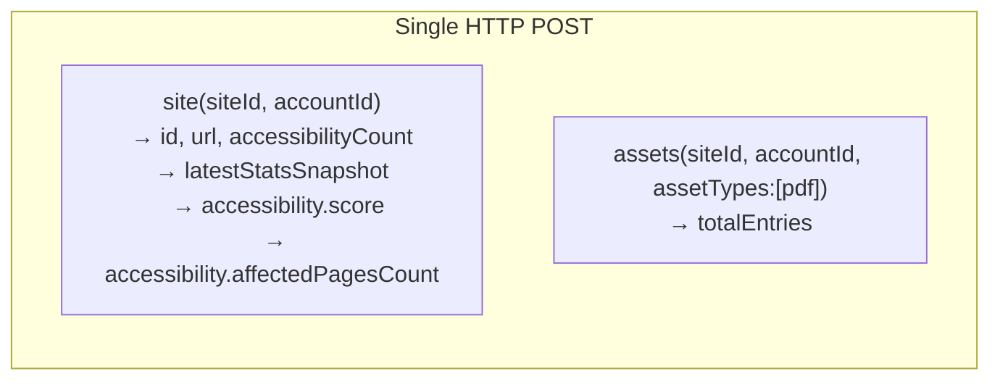

The response fields map to `SnapshotRow` like this:

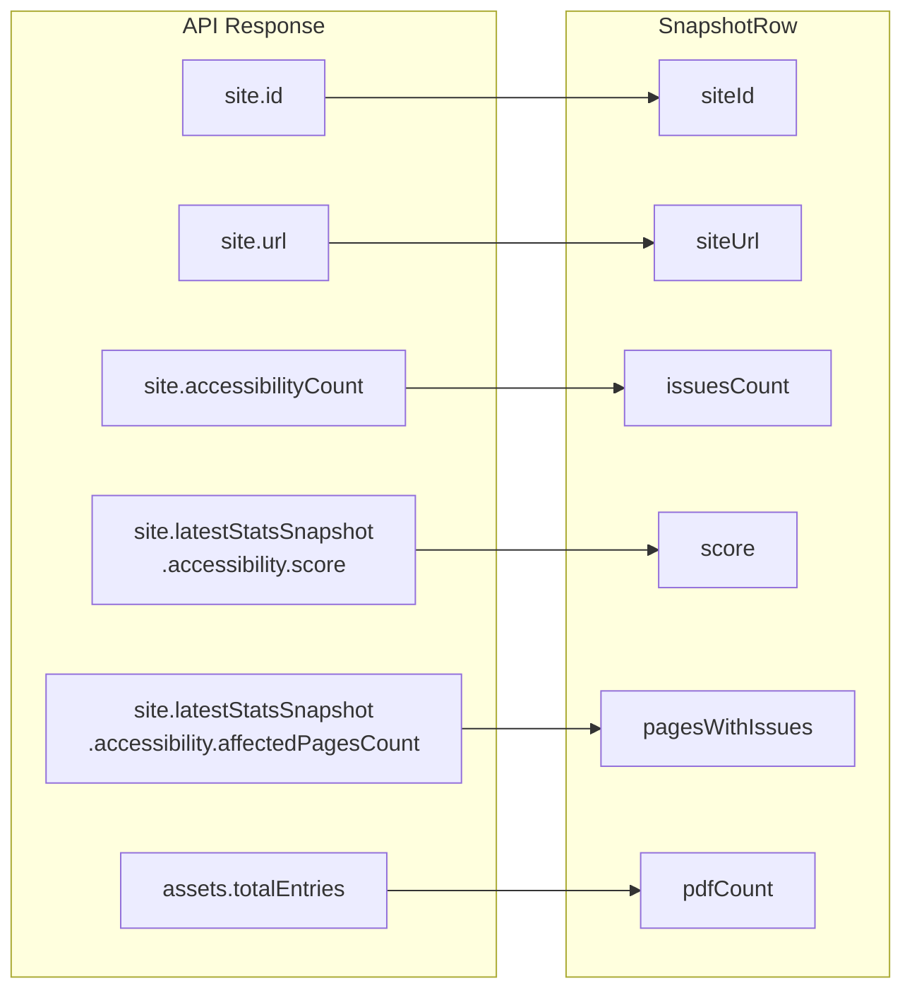

`collectedAt` is **not** set by the client — it is added by the orchestrator
after all fetches complete, ensuring every row in a run shares the same timestamp.

### Retry Logic

`src/utils/retry.ts` wraps every API call with exponential backoff.

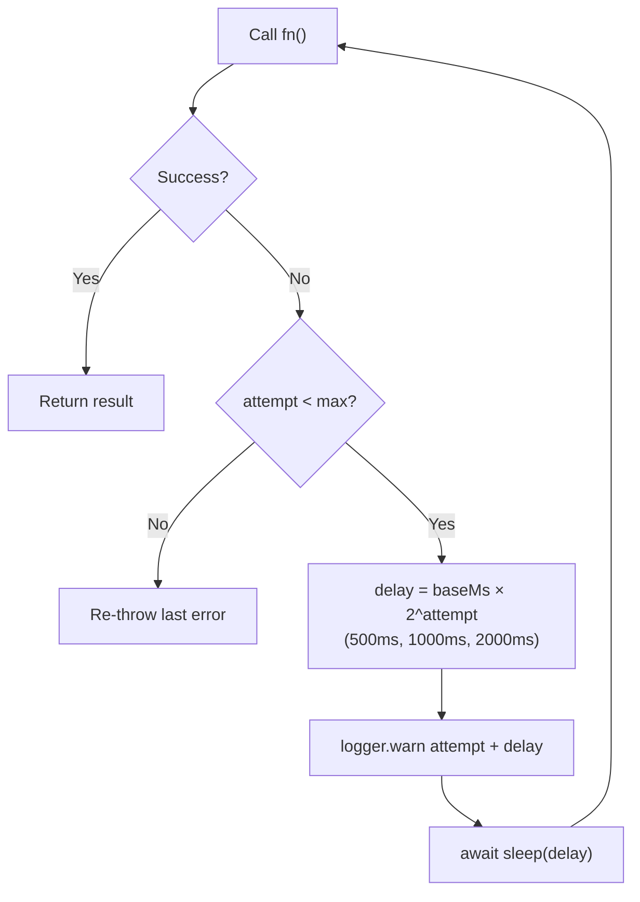

Default parameters: **3 attempts**, **500 ms base delay**.

| Attempt | Delay before retry |
|---|---|
| 0 → 1 | 500 ms |
| 1 → 2 | 1 000 ms |
| 2 (final) | throws |

---

## 7. Data Model

`src/models/SnapshotRow.ts` defines the single data shape that flows through
the entire pipeline, from API response to CSV row.

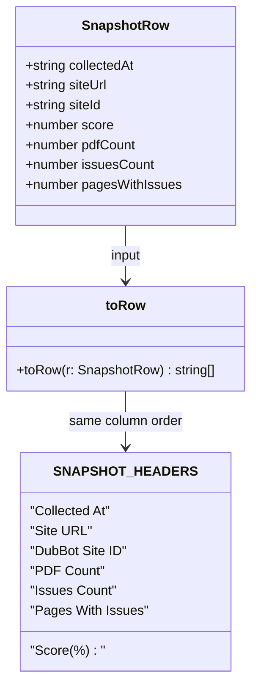

`toRow()` converts a `SnapshotRow` to a `string[]` in the same left-to-right
order as `SNAPSHOT_HEADERS`. The writer passes the assembled `string[][]` to
`csv-stringify/sync` (`stringify()`), which handles quoting and RFC 4180
escaping synchronously before the result is written in one shot.

---

## 8. CSV Writer Logic

`src/writers/csv.ts` handles the header-once, append-forever behaviour.

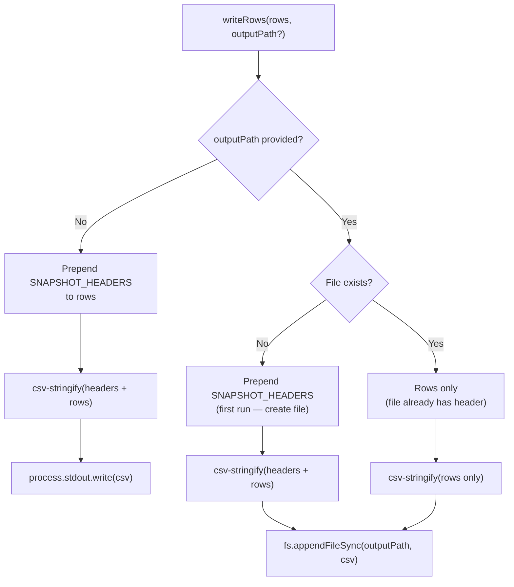

The result after multiple runs against the same file:

```
Collected At,Site URL,DubBot Site ID,Score (%),PDF Count,Issues Count,Pages With Issues  ← written once (run 1)
2026-03-03T08:00:00Z,https://business.utsa.edu/,5eea4b24...,99.96,62,9,8               ← run 1
2026-03-10T08:00:00Z,https://business.utsa.edu/,5eea4b24...,99.97,62,7,7               ← run 2
2026-03-17T08:00:00Z,https://business.utsa.edu/,5eea4b24...,99.98,62,5,5               ← run 3
```

---

## 9. Logging

`src/utils/logger.ts` creates a [pino](https://github.com/pinojs/pino)
instance writing structured JSON to **file descriptor 2 (stderr)**.

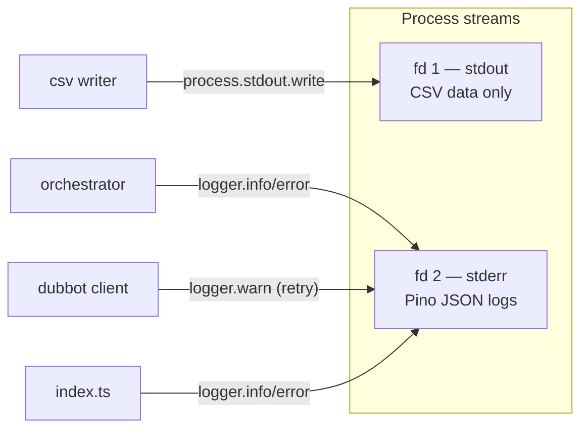

Keeping logs on stderr means `node dist/index.js run > out.csv` captures clean
CSV on stdout without any log noise.

Log levels used:

| Level | Where | When |
|---|---|---|
| `info` | orchestrator, index | Run start, successful fetch (verbose), summary |
| `warn` | retry | Before each retry attempt |
| `error` | orchestrator, index | Per-site failure, zero-row exit, unhandled error |

---

## 10. Exit Codes

| Code | Meaning |
|---|---|
| `0` | Success — all sites fetched, CSV written |
| `1` | Config/env validation failure OR unhandled exception |
| `2` | API error — connectivity failure (`validate`) or zero rows succeeded (`run`) |

---

## 11. File Reference

| File | Exports | Responsibility |
|---|---|---|
| `src/index.ts` | — (entry point) | Registers CLI commands with Commander, wires flags to `run()` |
| `src/config.ts` | `config`, `Config` | Loads `.env`, validates with Zod, exports typed singleton |
| `src/orchestrator.ts` | `run()`, `RunOptions` | Resolves site IDs (inline → file → env), stamps timestamp, fans out fetches, calls writer |
| `src/clients/dubbot.ts` | `fetchSiteStats()` | Sends combined GraphQL query, maps response to `SnapshotRow` |
| `src/writers/csv.ts` | `writeRows()` | Header-once append to file, or full output to stdout |
| `src/models/SnapshotRow.ts` | `SnapshotRow`, `SNAPSHOT_HEADERS`, `toRow()` | Shared data shape and CSV serialisation |
| `src/utils/logger.ts` | `logger` | Pino instance writing JSON to stderr |
| `src/utils/retry.ts` | `withRetry()` | Generic exponential-backoff wrapper for async functions |
